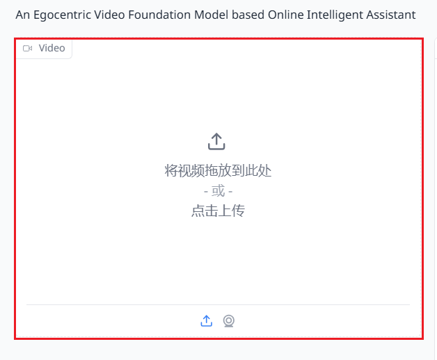
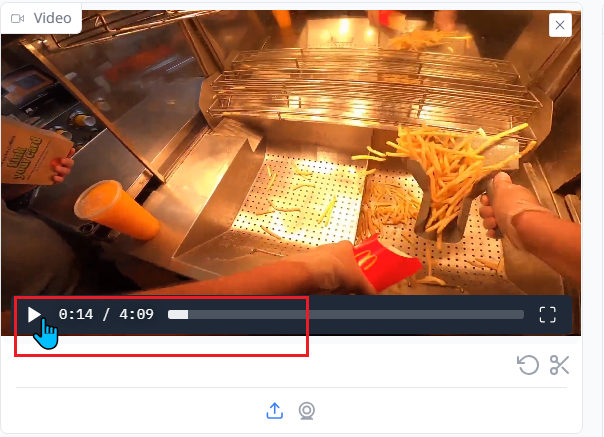
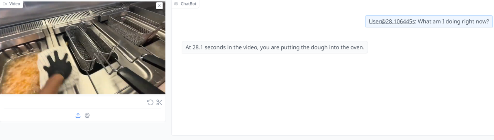
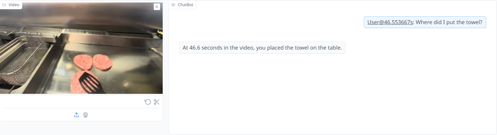
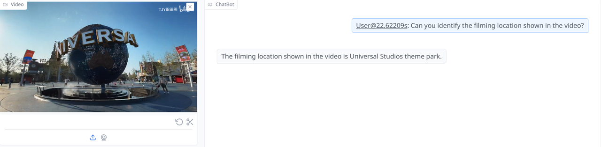

# Vinci - An Online Egocentric Video-Language Assistant
<a src="https://img.shields.io/badge/cs.CV-2412.21080-b31b1b?logo=arxiv&logoColor=red" href="https://arxiv.org/abs/2412.21080"> 
</a>  <a href="https://huggingface.co/hyf015/Vinci-8B-ckpt"> </a> 

> **Vinci: A Real-time Embodied Smart Assistant based on Egocentric Vision-Language Model**<br>
Arxiv, 2024<br>

## 💬 TL,DR

- **Overview**: A real-time, embodied smart assistant based on an egocentric vision-language model.
-  **Portable Device Compatibility**: Designed for smartphones and wearable cameras, operating in an "always on" mode.
-  **Hands-Free Interaction**: Users engage in natural conversations to ask questions and get responses delivered via audio.
-  **Real-Time Video Processing**: Processes long video streams to answer queries about current and historical observations.
-  **Task Planning and Guidance**: Provides task planning based on past interactions and generates visual task demonstrations.

## 📣 Demo video
[https://github.com/user-attachments/assets/ab019895-a7fe-4a1c-aa91-5a1e06dd4f2b](https://github.com/user-attachments/assets/ab019895-a7fe-4a1c-aa91-5a1e06dd4f2b)

[https://github.com/user-attachments/assets/6be2aa5c-81bb-4a85-b1cf-f08e30d97903](https://github.com/user-attachments/assets/6be2aa5c-81bb-4a85-b1cf-f08e30d97903)


## 🔨 Installation
```
git clone https://github.com/OpenGVLab/vinci.git
conda env create -f environment.yml
```
Requirements:
- python 3.8 and above
- pytorch 2.0 and above are recommended
- CUDA 11.4 and above are recommended
- Docker is required when deploying streaming demo
- Gradio is required when using local web-based demo
<br>

### Downloading Checkpoints
```
bash download.sh
```
Running download.sh will take up >100GB disk space.

## 🎓 Getting Started
We offer two ways to run our Vinci model

### 🎬  Online Streaming Demo
1. start the frontend, backend and model services: 
```bash
sudo ./boot.sh {start|stop|restart} [--cuda <CUDA_VISIBLE_DEVICES>] [--language chn/eng] [--version v0/v1]
```

- --cuda <CUDA_VISIBLE_DEVICES>: Specify the GPU devices to run the model
- --language <chn|eng>: Choose the language for the demo (default: chn).
  - chn: Chinese 
  - eng: English

- --version <v0|v1>: Select the model version (default: v1).
  - v0: Optimized for first-person perspective videos.
  - v1: Generalized model for both first-person and third-person perspective videos.

Then use the browser to access the frontend page：http://YOUR_IP_ADDRESS:19333 （E.g., http://102.2.52.16:19333）

2. Push live stream
With a smartphone app or GoPro/DJI cameras, push the stream to: `rtmp://YOUR_IP_ADDRESS/vinci/livestream`

With a webcam, use the following command: `ffmpeg -f video4linux2 -framerate 30 -video_size 1280x720 -i /dev/video1 -f alsa -i default  -vcodec libx264 -preset ultrafast -pix_fmt yuv420p -video_size 1280x720   -c:a aac -threads 0 -f flv rtmp://YOUR_IP_ADDRESS:1935/vinci/livestream`

#### Interact with Online Video Streaming Demo
1. Activate Model Service: To wake up the model and begin using it, simply say the wake-up phrase: "你好望舒 (Ni hao wang shu)" (Currently, only Chinese wakeup command is supported)
2. Chat with Vinci: Once activated, you can start chatting with Vinci with speech. The model will respond in text and speech. 
Tip: For the best experience, speak clearly and at a moderate pace. 
3. Generate Predictive Visualizations: If you want to generate a predictive visualization of actions, include the keyword "可视化 （Ke shi hua)" in your command. 

### 🎬 Gradio Demo for uploaded videos
```bash
python demovl.py  [--cuda <CUDA_VISIBLE_DEVICES>] [--language chn/eng] [--version v0/v1]
```
- --cuda <CUDA_VISIBLE_DEVICES>: Specify the GPU devices to run the model
- --language <chn|eng>: Choose the language for the demo (default: chn).
  - chn: Chinese 
  - eng: English
  
- --version <v0|v1>: Select the model version (default: v1).
  - v0: Optimized for first-person perspective videos.
  - v1: Generalized model for both first-person and third-person perspective videos.

#### Interact with Gradio Demo
1. Upload local video file
<div align="center">

</div>

2. Click Upload & Start Chat button to initiate the chat session
<div align="center">

</div>

3. Click the play button to start playing the video
<div align="center">

</div>

4. Adjusting the Stride of Memory. This allows you to control the granularity of the model's memory. 
<div align="center">

</div>

5. Real-Time Interaction：Type your questions in the chat box. The model will respond based on the current frame and historical context.

<div align="center">
  <figure>
    
    <div style="text-align: center;">
    <figcaption>Describe current action</figcaption>
    </div>
  </figure>
</div>
<br>

<div align="center">
  <figure>
    
    <div style="text-align: center;">
      <figcaption>Retrieve object from the history</figcaption>
    </div>
  </figure>
</div>
<br>

<div align="center">
  <figure>
    
    <div style="text-align: center;">
    <figcaption>Summarize previous actions</figcaption>
    </div>
  </figure>
</div>
<br>

<div align="center">
  <figure>
    
    <div style="text-align: center;">
    <figcaption>Scene understanding</figcaption>
    </div>
  </figure>
</div>
<br>

<div align="center">
  <figure>
    
    <div style="text-align: center;">
    <figcaption>Temporal grounding</figcaption>
    </div>
  </figure>
</div>
<br>

<div align="center">
  <figure>
    
    <div style="text-align: center;">
    <figcaption>Predict future actions</figcaption>
    </div>
  </figure>
</div>
<br>


6. Generate future videos: based on the current frame and the historical context, the model can generate a short future video.
<div align="center">
  <figure>
    
    <figcaption style="text-align: center;">Generate future actions</figcaption>
  </figure>
</div>
<br>


## ♥️ Origin
The name "Vinci" embodies several layers of meaning:

- It is inspired by the famous Renaissance master Leonardo da Vinci, symbolizing a wealth of knowledge and insight, and suggesting that this assistant can provide equally exceptional service to users.
- The word "Vinci" is derived from the Latin "vincere," meaning "to conquer" or "to overcome," implying that this assistant helps users overcome various difficulties and challenges.
- Phonetically, it resembles "Vision," highlighting the assistant's core function of analyzing and responding based on visual information.
- It represents a fusion of elegance, wisdom, and innovation, complementing the high-tech nature of first-person camera devices.

望舒 - 出自《楚辞·离骚》：“前望舒使先驱兮，后飞廉使奔属。” 望舒是神话传说中替月亮驾车的天神，描述象征着引导和指引的意义

## ✒️ Citation
If this work is helpful for your research, please consider citing us.
```
@article{pei2024egovideo,
  title={Vinci: A Real-time Embodied Smart Assistant based on Egocentric Vision-Language Model},
  author={Huang, Yifei and Xu, Jilan and Pei, Baoqi and He, Yuping and Chen, Guo and Yang, Lijin and Chen, Xinyuan and Wang, Yaohui and Nie, Zheng and Liu, Jinyao and Fan, Guoshun and Lin, Dechen and Fang, Fang and Li, Kunpeng and Yuan, Chang and Wang, Yali and Qiao, Yu and Wang, Limin},
  journal={arXiv preprint arXiv:2412.21080},
  year={2024}
}
```

```
@article{pei2024egovideo,
  title={EgoVideo: Exploring Egocentric Foundation Model and Downstream Adaptation},
  author={Pei, Baoqi and Chen, Guo and Xu, Jilan and He, Yuping and Liu, Yicheng and Pan, Kanghua and Huang, Yifei and Wang, Yali and Lu, Tong and Wang, Limin and Qiao, Yu},
  journal={arXiv preprint arXiv:2406.18070 },
  year={2024}
}
```
```
@inproceedings{xu2024retrieval,
  title={Retrieval-augmented egocentric video captioning},
  author={Xu, Jilan and Huang, Yifei and Hou, Junlin and Chen, Guo and Zhang, Yuejie and Feng, Rui and Xie, Weidi},
  booktitle={Proceedings of the IEEE/CVF Conference on Computer Vision and Pattern Recognition},
  pages={13525--13536},
  year={2024}
}
```
```
 @InProceedings{huang2024egoexolearn,
     title={EgoExoLearn: A Dataset for Bridging Asynchronous Ego- and Exo-centric View of Procedural Activities in Real World},
     author={Huang, Yifei and Chen, Guo and Xu, Jilan and Zhang, Mingfang and Yang, Lijin and Pei, Baoqi and Zhang, Hongjie and Lu, Dong and Wang, Yali and Wang, Limin and Qiao, Yu},
     booktitle={Proceedings of the IEEE/CVF Conference on Computer Vision and Pattern Recognition},
     year={2024}
 }
```
```
@inproceedings{chen2023seine,
  title={Seine: Short-to-long video diffusion model for generative transition and prediction},
  author={Chen, Xinyuan and Wang, Yaohui and Zhang, Lingjun and Zhuang, Shaobin and Ma, Xin and Yu, Jiashuo and Wang, Yali and Lin, Dahua and Qiao, Yu and Liu, Ziwei},
  booktitle={The Twelfth International Conference on Learning Representations},
  year={2023}
}
```
```
@article{wang2024internvideo2,
  title={Internvideo2: Scaling video foundation models for multimodal video understanding},
  author={Wang, Yi and Li, Kunchang and Li, Xinhao and Yu, Jiashuo and He, Yinan and Wang, Chenting and Chen, Guo and Pei, Baoqi and Zheng, Rongkun and Xu, Jilan and Wang, Zun and others},
  journal={arXiv preprint arXiv:2403.15377},
  year={2024}
}
```
